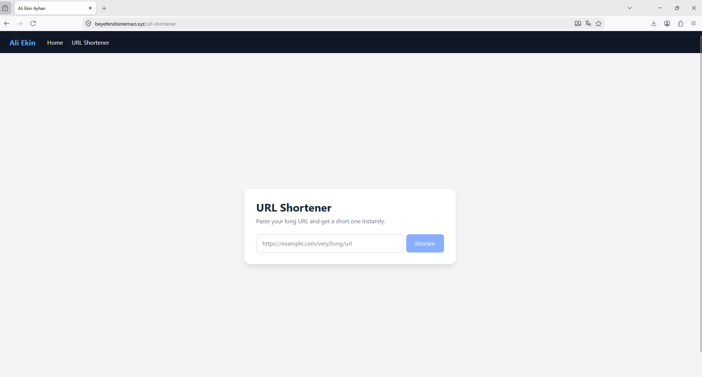
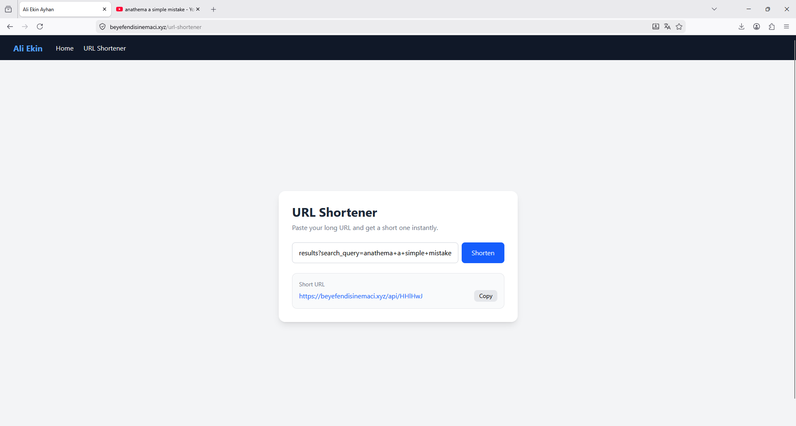

# Portfolio Backend

🔗 Live: [beyefendisinemaci.xyz/url-shortener](https://beyefendisinemaci.xyz/url-shortener)

A modular backend built with Spring Boot, designed to grow with new features over time. Currently includes a URL Shortener service.

## Tech Stack

- **Java 17** + **Spring Boot 4.0.6**
- **MySQL** — persistent storage
- **Redis** — caching & rate limiting
- **Bucket4j** — token bucket rate limiting algorithm
- **MapStruct** — DTO mapping
- **Docker** + **Docker Compose**
- **AWS EC2** — deployment
- **AWS ECR** — container registry
- **GitHub Actions** — CI/CD pipeline

## Modules

### URL Shortener (`/api`)

| Method | Endpoint           | Description              |
| ------ | ------------------ | ------------------------ |
| POST   | `/api/shorten`     | Shorten a URL            |
| GET    | `/api/{shortCode}` | Redirect to original URL |

## Architecture

- Each request is checked against a **global rate limit** (10 req/min per IP)
- `/api/shorten` has an additional **endpoint-specific rate limit** (5 req/min per IP)
- Shortened URLs are **cached in Redis** for 24 hours to reduce DB load
- Rate limit state is stored in Redis, so limits persist across app restarts

## Screenshots

### Home


### URL Shortener




## Running Locally

### Prerequisites

- Docker & Docker Compose

### Steps

1. Clone the repo

```bash
git clone https://github.com/aliekinayhan/portfolio-backend.git
cd portfolio-backend
```

2. Create a `.env` file

```env
DB_URL=jdbc:mysql://your-db-host:3306/yourdb
DB_USERNAME=your_username
DB_PASSWORD=your_password
APP_BASE_URL=http://localhost:8080
APP_IMAGE=portfolio-backend:latest
```

3. Build and run

```bash
mvn clean package -DskipTests
docker compose up --build
```

## CI/CD

Push to `main` triggers the GitHub Actions pipeline:

1. Build JAR with Maven
2. Build & push Docker image to AWS ECR
3. Copy `docker-compose.yml` to EC2 via SCP
4. Pull latest image and restart services via Docker Compose
